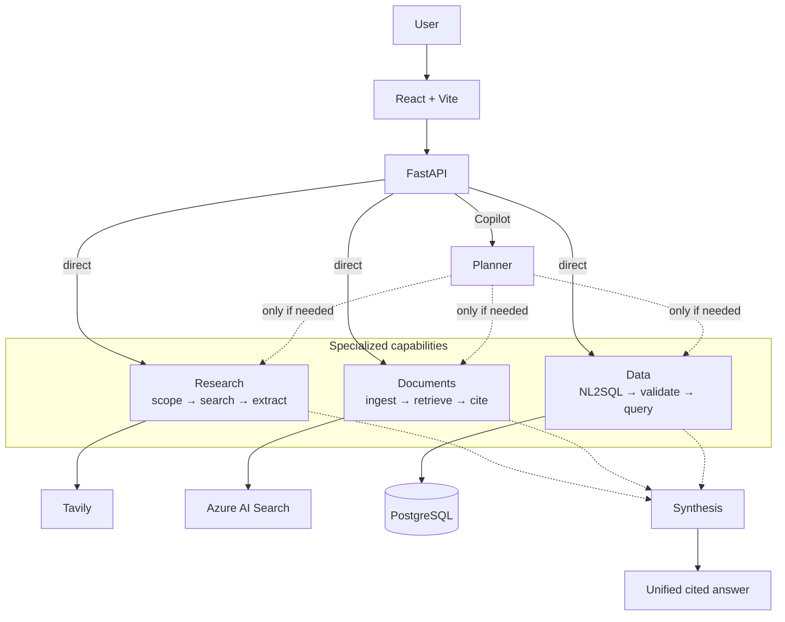
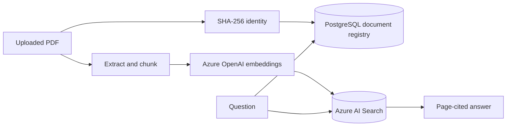

## Financial Intelligence Copilot

An evidence-grounded financial intelligence platform that combines multi-step web research, document RAG, and natural-language analytics over structured financial data.

The application can automatically route a financial question to one or more specialized capabilities, combine the resulting evidence, and return a traceable answer with web citations, PDF page references, and database provenance.

### Core capabilities

| Workspace | Purpose | Main technologies |
|---|---|---|
| **Copilot** | Routes a question to the required capabilities and synthesizes a unified answer | LangGraph, Azure OpenAI, Pydantic |
| **Research** | Searches external sources, screens candidate documents, extracts evidence, and produces cited answers | LangGraph, Tavily, Azure OpenAI |
| **Documents** | Uploads and indexes financial PDFs, retrieves relevant passages, and generates page-cited answers | Azure AI Search, PostgreSQL document registry, Azure OpenAI embeddings, PyPDF |
| **Data** | Converts natural-language questions into validated read-only SQL and returns structured financial facts | PostgreSQL, SQLAlchemy, SQLGlot, Azure OpenAI |

Each specialized workspace remains independently accessible. The unified Copilot is used when a question requires automatic routing or evidence from multiple sources.

### Example

Question:

> How does the EIB manage liquidity risk, and what was its 2024 liquidity coverage ratio?

The Copilot:

1. routes the narrative part to Document RAG;
2. routes the quantitative part to the Data Agent;
3. retrieves passages from the EIB Financial Report;
4. queries the structured financial database;
5. combines both results into one answer with page-level provenance.

### Architecture



Solid arrows are the standalone workspace APIs. Dashed arrows are Copilot routing and synthesis: the planner calls only the modules the question needs, then combines their evidence. Traces are sent to LangSmith.

#### Document persistence model

Document RAG separates durable metadata from searchable content:



PostgreSQL stores document identity, ingestion metadata, page counts, chunk
counts, and warnings. Azure AI Search stores the extracted chunks and vector
embeddings. The API container remains stateless, so document retrieval and
deduplication survive container restarts and scale-to-zero events.

### Design principles

- **Evidence first** — important claims must be supported by retrieved sources or structured records.
- **Capability separation** — research, document retrieval, and data analysis remain independently testable.
- **Controlled routing** — the planner selects only the capabilities required for the question.
- **Safe data access** — generated SQL is validated and executed as read-only.
- **Graceful refusal** — the system reports insufficient evidence instead of inventing unsupported answers.
- **Traceability** — answers expose citations, PDF pages, database provenance, warnings, and trace identifiers.

#### Technology stack

##### Backend

- Python 3.12
- FastAPI
- LangGraph
- LangChain
- Pydantic
- SQLAlchemy and SQLGlot

##### AI and retrieval

- Azure OpenAI
- Azure AI Search
- Tavily Search and Extract
- LangSmith tracing and evaluation

##### Data and frontend

- PostgreSQL
- Docker Compose
- React
- TypeScript
- Vite

### Deployment

The application is packaged as a multi-stage Docker image and deployed to Azure
Container Apps. Azure Container Registry stores immutable, Git-tagged images;
Key Vault and a user-assigned managed identity provide runtime secrets; Log
Analytics and LangSmith provide platform and LLM observability.

See the [Azure deployment runbook](docs/azure-deployment.md) for the deployment
topology, release procedure, verification checks, troubleshooting, and rollback
process.

### Local development

#### Prerequisites

- Python 3.12
- [uv](https://docs.astral.sh/uv/)
- Node.js 22 and npm
- Docker with Docker Compose
- Azure OpenAI chat and embedding deployments
- Azure AI Search
- Tavily API access

#### 1. Install dependencies

```bash
uv sync
npm --prefix frontend install
```

#### 2. Configure the environment

Copy the example configuration:

```bash
cp .env.example .env
```

Configure the following services in `.env`:

| Variable | Purpose |
|---|---|
| `TAVILY_API_KEY` | External financial research and page extraction |
| `AZURE_OPENAI_ENDPOINT` | Azure OpenAI resource endpoint |
| `AZURE_OPENAI_API_KEY` | Azure OpenAI authentication |
| `AZURE_OPENAI_DEPLOYMENT` | Chat-model deployment |
| `AZURE_OPENAI_EMBEDDING_DEPLOYMENT` | Embedding-model deployment |
| `AZURE_AI_SEARCH_ENDPOINT` | Document vector-index endpoint |
| `AZURE_AI_SEARCH_API_KEY` | Search administration and query access |
| `AZURE_AI_SEARCH_INDEX_NAME` | Document chunk index |
| `DATABASE_URL` | Database initialization and seed connection |
| `DATA_AGENT_DATABASE_URL` | Restricted read-only PostgreSQL connection used by the Data Agent |
| `DOCUMENT_REGISTRY_DATABASE_URL` | PostgreSQL connection used to persist uploaded-document identity and ingestion metadata |
| `LANGSMITH_API_KEY` | Optional tracing and evaluation |
| `LANGSMITH_PROJECT` | LangSmith trace project |

Do not commit `.env` or any API keys.

#### 3. Start PostgreSQL

```bash
docker compose up -d postgres
docker compose ps
```

The container exposes PostgreSQL on local port `5433` to avoid conflicts with an existing installation on port `5432`.

#### 4. Initialize and seed the database

```bash
uv run python scripts/init_database.py
uv run python scripts/seed_financial_data.py
uv run python scripts/smoke_database.py
```

Database initialization creates both the structured financial-data schema and
the persistent document registry. The seed command loads only the deterministic
financial facts used by the Data Agent demonstration.

The seed operation inserts a small, deterministic EIB financial dataset used by the Data Agent demonstrations. It is idempotent: running it again updates existing records instead of duplicating them.

Expected connection check:

```text
database=ficopilot
user=ficopilot
```

#### 5. Start the application

For the complete application:

```bash
./start.sh live
```

Open:

- Frontend: `http://127.0.0.1:5173`
- FastAPI documentation: `http://127.0.0.1:8000/docs`
- Health check: `http://127.0.0.1:8000/health`

Press `Ctrl+C` to stop the API and frontend. PostgreSQL continues running in Docker and can be stopped with:

```bash
docker compose stop postgres
```

#### Runtime modes

| Command | Available capability | External requirements |
|---|---|---|
| `./start.sh demo` | Deterministic Research demo | None |
| `./start.sh live-search` | Tavily research with extractive synthesis | Tavily |
| `./start.sh live` | Copilot, Research, Documents and Data | Azure OpenAI, Azure AI Search, Tavily and PostgreSQL |

The `demo` and `live-search` modes configure only the Research service. Use `live` for the complete multi-capability application.

### Verification

Auto-fix lint and formatting locally before pushing:

```bash
uv run ruff check . --fix
uv run ruff format .
```

`pre-commit` already runs the same Ruff fix and format hooks on commit. Install the hooks once with `uv run pre-commit install`.

Then run the backend test and lint checks that CI uses:

```bash
uv run pytest
uv run ruff check .
uv run ruff format --check .
```

Build the frontend:

```bash
npm --prefix frontend run build
```

A successful frontend build performs both TypeScript compilation and the Vite production build.
