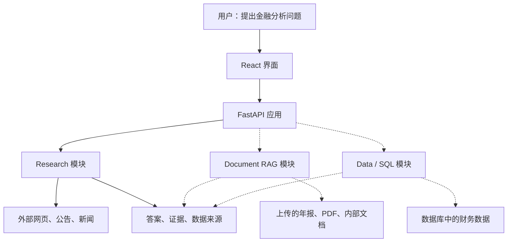

# Financial Intelligence Copilot

An evidence-first financial research application combining web research, document retrieval, and structured data analysis.

## Start

Copy `.env.example` to `.env` and fill in Tavily plus Azure OpenAI keys, then:

```bash
./start.sh
```

This starts the live API (`http://127.0.0.1:8000`) and the Vite frontend (`http://127.0.0.1:5173`). Open the frontend URL. Ctrl+C stops both.

```bash
./start.sh demo          # no API keys
./start.sh live-search   # Tavily only, extractive synthesis
```



