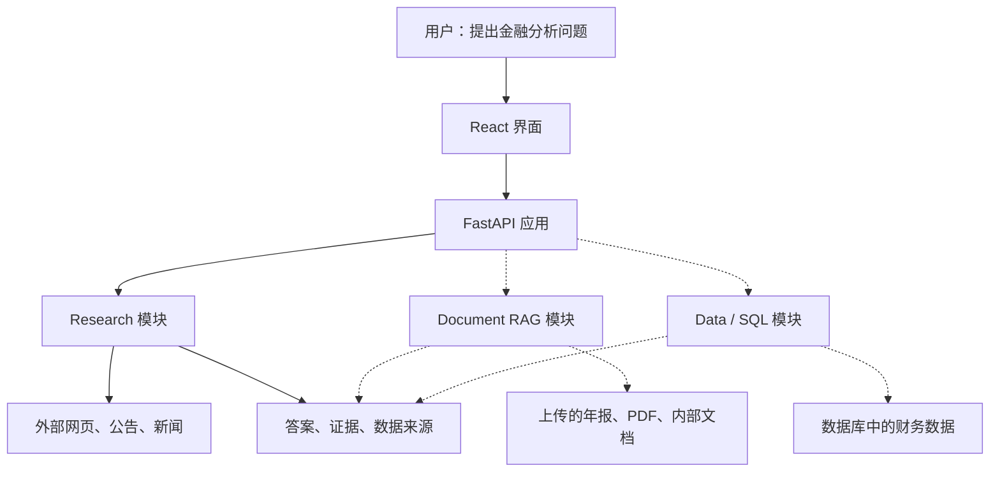

# Financial Intelligence Copilot

An evidence-first financial research application combining web research, document retrieval, and structured data analysis.

## Start

Copy `.env.example` to `.env` and fill in Tavily plus Azure OpenAI keys, then:

```bash
./start.sh
```

This starts the live API (`http://127.0.0.1:8000`) and the Vite frontend (`http://127.0.0.1:5173`). Open the frontend URL. Ctrl+C stops both.

```bash
./start.sh demo          # no API keys
./start.sh live-search   # Tavily only, extractive synthesis
```




| 模块 | 典型问题 | 核心能力 |
|---|---|---|
| Research | “最近有哪些事件可能影响这家公司？” | 搜索网页、读取来源、综合证据 |
| Document RAG | “这份年报如何描述流动性风险？” | 文档解析、分块、检索、页码溯源 |
| Data / SQL | “过去三年的收入增长率是多少？” | 理解数据表、生成并校验 SQL、执行计算 |

以后，综合问题可以同时使用它们：
“根据财务数据分析收入变化，结合年报解释原因，再补充最新公开信息。”

其中：
- Data 模块负责算数。
- Document RAG 负责查年报里的解释。
- Research 负责补充外部信息。
- 综合层负责组织答案并保留各自的数据来源。