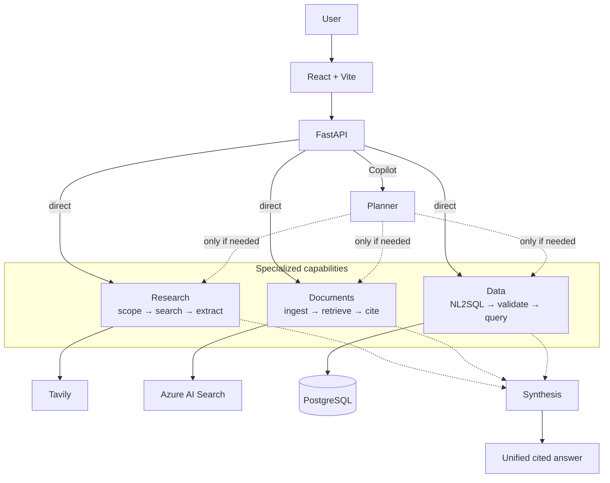

## Financial Intelligence Copilot

An evidence-grounded financial based intelligence platform that combines multi-step web research, document RAG, and natural-language analytics over structured financial data.

The application can automatically route a financial question to one or more specialized capabilities, combine the resulting evidence, and return a traceable answer with web citations, PDF page references, and database provenance.

### Core capabilities

| Workspace | Purpose | Main technologies |
|---|---|---|
| **Copilot** | Routes a question to the required capabilities and synthesizes a unified answer | LangGraph, Azure OpenAI, Pydantic |
| **Research** | Searches external sources, screens candidate documents, extracts evidence, and produces cited answers | LangGraph, Tavily, Azure OpenAI |
| **Documents** | Uploads and indexes financial PDFs, retrieves relevant passages, and generates page-cited answers | Azure AI Search, embeddings, PyPDF |
| **Data** | Converts natural-language questions into validated read-only SQL and returns structured financial facts | PostgreSQL, SQLAlchemy, SQLGlot, Azure OpenAI |

Each specialized workspace remains independently accessible. The unified Copilot is used when a question requires automatic routing or evidence from multiple sources.

### Example

Question:

> How does the EIB manage liquidity risk, and what was its 2024 liquidity coverage ratio?

The Copilot:

1. routes the narrative part to Document RAG;
2. routes the quantitative part to the Data Agent;
3. retrieves passages from the EIB Financial Report;
4. queries the structured financial database;
5. combines both results into one answer with page-level provenance.

### Architecture

Solid arrows are the standalone workspace APIs. Dashed arrows are Copilot routing and synthesis: the planner calls only the modules the question needs, then combines their evidence. Traces are sent to LangSmith.

### Design principles

- **Evidence first** — important claims must be supported by retrieved sources or structured records.
- **Capability separation** — research, document retrieval, and data analysis remain independently testable.
- **Controlled routing** — the planner selects only the capabilities required for the question.
- **Safe data access** — generated SQL is validated and executed as read-only.
- **Graceful refusal** — the system reports insufficient evidence instead of inventing unsupported answers.
- **Traceability** — answers expose citations, PDF pages, database provenance, warnings, and trace identifiers.

#### Technology stack

##### Backend

- Python 3.12
- FastAPI
- LangGraph
- LangChain
- Pydantic
- SQLAlchemy and SQLGlot

##### AI and retrieval

- Azure OpenAI
- Azure AI Search
- Tavily Search and Extract
- LangSmith tracing and evaluation

##### Data and frontend

- PostgreSQL
- Docker Compose
- React
- TypeScript
- Vite

