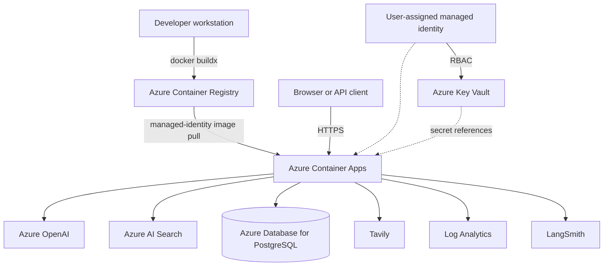

# Azure deployment runbook

This runbook describes how the development deployment is released, verified,
and recovered. It intentionally contains resource names but no credentials or
secret values.

## Deployment topology



The container is stateless. PostgreSQL stores structured financial facts and
the persistent document registry. Azure AI Search stores document chunks and
embeddings. Key Vault stores credentials; the Container App receives only
secret references.

## Development resources

| Resource | Name | Region |
|---|---|---|
| Resource group | `rg-ai-learning` | — |
| Container App | `ficopilot-app-kudou-dev` | Sweden Central |
| Container Apps environment | `ficopilot-env-kudou-dev` | Sweden Central |
| User-assigned managed identity | `ficopilot-id-kudou-dev` | France Central |
| Key Vault | `ficopilot-kv-kudou-dev` | Sweden Central |
| PostgreSQL flexible server | `ficopilot-pg-kudou-dev` | Sweden Central |
| Azure AI Search | `ficopilot-search-kudou-dev` | France Central |

Azure Container Registry and Log Analytics are hosted in France Central. The
cross-region layout is acceptable for this learning environment, but a
production design should review data residency, latency, private networking,
availability, and disaster-recovery requirements.

## Security boundaries

The deployment uses separate identities for separate responsibilities:

| Connection | Intended permission |
|---|---|
| Database administrator | Schema initialization and controlled maintenance |
| Data Agent database role | Read-only access to approved financial tables |
| Document Registry database role | `SELECT`, `INSERT`, and `UPDATE` on `document_records` |
| Container App managed identity | Pull images from ACR and resolve Key Vault secret references |

Never place passwords, API keys, connection strings, or `.env` contents in the
repository, Docker image, command history, or this runbook.

## Pre-deployment checks

Run all quality checks before creating an image:

```bash
uv run pytest
uv run ruff check .
uv run ruff format --check .
npm --prefix frontend run lint
npm --prefix frontend run build
```

Confirm that the working tree contains only the changes intended for release:

```bash
git status --short
```

Use the Git commit as an immutable image tag:

```bash
TAG=$(git rev-parse --short HEAD)
```

## Build and push the image

Find the registry name if it is not already known:

```bash
az acr list \
  --resource-group rg-ai-learning \
  --query "[].{Name:name,LoginServer:loginServer}" \
  --output table
```

Set the selected registry and resolve its login server:

```bash
ACR_NAME="<acr-name>"

ACR_SERVER=$(az acr show \
  --resource-group rg-ai-learning \
  --name "$ACR_NAME" \
  --query loginServer \
  --output tsv)
```

Build for the Azure Container Apps runtime and push directly to ACR:

```bash
az acr login --name "$ACR_NAME"

docker buildx build \
  --platform linux/amd64 \
  --tag "$ACR_SERVER/financial-intelligence-copilot:$TAG" \
  --push \
  .
```

Explicitly selecting `linux/amd64` prevents an Apple Silicon workstation from
publishing an incompatible ARM-only image.

## Release a new revision

Update the Container App to the immutable image tag:

```bash
az containerapp update \
  --resource-group rg-ai-learning \
  --name ficopilot-app-kudou-dev \
  --image "$ACR_SERVER/financial-intelligence-copilot:$TAG"
```

Container Apps creates a new revision when the image or application
configuration changes. Inspect revision readiness and traffic:

```bash
az containerapp revision list \
  --resource-group rg-ai-learning \
  --name ficopilot-app-kudou-dev \
  --query "[].{Name:name,Active:properties.active,Traffic:properties.trafficWeight,Health:properties.healthState,Created:properties.createdTime}" \
  --output table
```

## Secret-reference wiring

Secret references are normally configured once, not during every release. For
example, the persistent document registry uses this mapping:

```text
Key Vault secret:       document-registry-database-url
Container App secret:   doc-reg-db-url
Environment variable:   DOCUMENT_REGISTRY_DATABASE_URL
```

The Container App secret points to Key Vault through the user-assigned managed
identity. The environment variable points to the Container App secret alias,
not to the connection string itself.

List configured secret names without displaying values:

```bash
az containerapp secret list \
  --resource-group rg-ai-learning \
  --name ficopilot-app-kudou-dev \
  --query "[].name" \
  --output table
```

## Release verification

Set the public application URL:

```bash
APP_URL="https://ficopilot-app-kudou-dev.proudplant-2eb1aca9.swedencentral.azurecontainerapps.io"
```

Verify runtime health:

```bash
curl -sS "$APP_URL/health"
```

Expected result:

```json
{"status":"ok"}
```

Then verify one representative request for each affected capability. A release
that changes shared application wiring should cover Document RAG, the Data
Agent, and the unified Copilot rather than relying only on the health endpoint.

For Document Registry changes, perform the stronger persistence check:

1. Upload a PDF and record its `document_id` and `ingested_at` values.
2. Restart the active Container Apps revision.
3. Upload the identical PDF again.
4. Confirm `cache_hit=true` and unchanged document identity and ingestion time.
5. Ask a document question with that document ID after the restart.

## Logs and traces

Use Container Apps console logs for application startup and runtime failures:

```bash
az containerapp logs show \
  --resource-group rg-ai-learning \
  --name ficopilot-app-kudou-dev \
  --type console \
  --tail 100
```

Use system logs for revision, image-pull, secret-reference, and platform-level
failures:

```bash
az containerapp logs show \
  --resource-group rg-ai-learning \
  --name ficopilot-app-kudou-dev \
  --type system \
  --tail 100
```

Log Analytics retains platform and application logs. LangSmith provides the
LLM-level trace, including Copilot planning, capability calls, synthesis,
latency, and token usage. These tools cover different observability layers and
are complementary.

## Recovery and rollback

Because image tags are derived from Git commits, rollback means redeploying the
last known-good tag:

```bash
PREVIOUS_TAG="<known-good-git-sha>"

az containerapp update \
  --resource-group rg-ai-learning \
  --name ficopilot-app-kudou-dev \
  --image "$ACR_SERVER/financial-intelligence-copilot:$PREVIOUS_TAG"
```

After rollback, repeat the health check and the smoke test for the affected
capability. Database changes require a compatible migration strategy; an image
rollback alone cannot safely reverse an incompatible schema change.

## Current development limitations

- PostgreSQL and Azure AI Search use public endpoints protected by firewall
  rules and credentials; production should evaluate private endpoints and VNet
  integration.
- The development Container App uses a small, scale-to-zero configuration and
  does not provide production high availability.
- Database schema creation currently uses SQLAlchemy metadata rather than a
  versioned migration system such as Alembic.
- Raw uploaded PDFs are not retained in Blob Storage; the current durable
  stores are the PostgreSQL document registry and Azure AI Search index.
- Infrastructure is not yet represented as Terraform or Bicep.

