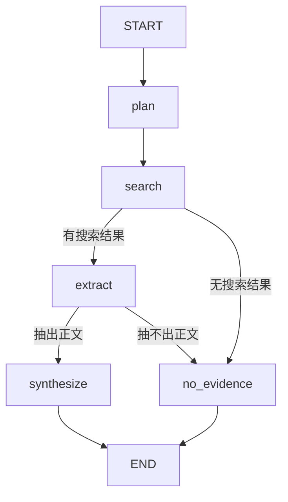

# LLM-powered research workflow

由大模型辅助的研究工作流。

前端 → FastAPI → ResearchService
                    ↓
             plan → scope → search → select → extract → synthesize


React
  → FastAPI
  → ResearchService
  → LangGraph
      → Scope identification
      → Web search
      → Source screening
      → Evidence extraction
      → Evidence-only synthesis
  → Answer + Claims + Citations + Process summary
  
点击一次 **Run research**，到底发生了什么？以已经运行过的问题为例：

> What market-related financial risks does Microsoft disclose in its 2025 Annual Report?

## 1. React 收集问题，管理页面状态

表单产生：

```json
{
  "question": "...",
  "as_of": "...",
  "max_sources": 5
}
```

`useResearch` 管理：

```text
idle → loading → success / error
```

它关心的是：按钮是否等待、是否展示错误、是否展示结果。

前端不负责决定怎么研究，也不直接持有 Azure 或 Tavily 密钥。

## 2. FastAPI 接收并验证请求

FastAPI 把 JSON 转成 `ResearchRequest`。Pydantic 检查已定义的规则，例如：

- 问题不能是空白。
- 时间必须带时区。
- 来源数量必须在允许范围内。

API 同时准备 `trace_id`，让一次请求可以被识别和关联。

这里验证的是「请求格式是否合格」，不是「这个问题能否被正确回答」。

## 3. ResearchService 启动业务流程

当前 [`service.py`](service.py) 主要做两件事：

1. 调用 `graph.invoke(...)`
2. 取出并返回 `ResearchResult`

为什么还需要这一层？因为 HTTP 接口只需要知道「执行一次研究」，不必了解 LangGraph 的 state、context 和节点。

它是一个很薄的适配层，不是另一个服务器。

## 4. LangGraph 安排各个步骤

当前 [`graph.py`](graph.py) 的实际流程是：



具体来说：

- **plan**：生成固定说明文字，当前不调用模型。
- **search**：Python 代码调用 Tavily Search，得到 `SearchHit`。
- **路由**：检查列表是否为空，当前不调用模型。
- **extract**：调用 Tavily Extract，把网页正文收成 `Citation`。
- **synthesize**：才调用配置的 Azure 模型。
- **no_evidence**：返回固定的证据不足结果，不调用模型。

所以，不是图中的每个节点都是一个 AI，也不是 Azure 模型自己决定去搜索。现在是代码安排模型何时工作。

## 5. 模型生成结构化草稿

在 [`azure_synthesis_provider.py`](azure_synthesis_provider.py) 中：

```python
self._chain = prompt | structured_model
```

可以理解成：把问题和证据放进 Prompt，再交给模型，要求返回指定结构的草稿。这里的 `|` 是 LangChain 的组合方式，不是另一个 Agent。

这个草稿是 `SynthesisDraft`，包含：

- `answer`：整体回答。
- `claims`：可单独检查的结论。
- `warnings`：限制和提醒。

## 6. 后端组装结果，前端展示

后端给草稿补上：

- 实际提供的 `citations`
- 请求的时间范围
- `trace_id`

然后用 `ResearchResult` 检查引用关系，返回 JSON，由 React 展示。

例如，模型引用了 `source-999`，但实际没有这个来源，校验会拒绝它。

但「引用 ID 存在」，并不能证明「原文支持这个结论」。这两种正确性必须分开。

## 7. 各种框架和代码抽象分别负责什么？

先把框架放回它该在的位置：

| 技术 | 在当前项目中的职责 |
| --- | --- |
| React | 展示和交互 |
| Vite | 前端开发服务器、构建工具、开发时的 API 代理 |
| FastAPI | HTTP 请求和响应 |
| Pydantic | 数据结构与显式校验规则 |
| LangChain | Prompt、模型和工具调用的组合与适配 |
| LangGraph | 步骤顺序、分支和共享状态 |
| Tavily | 搜索与网页内容抽取服务 |
| Azure OpenAI | 提供模型推理服务 |

LangChain 不等于模型，LangGraph 不等于 Agent，Azure 也不等于整个后端。

再看几个反复遇到的代码细节。

### State、Node、Edge：任务数据、工作步骤、执行顺序

LangGraph 最核心的认知只有三个：

- **State**：这次任务目前有哪些数据。
- **Node**：读取数据，完成一项工作，返回更新。
- **Edge**：决定下一步执行哪个节点。

接入 Extract 后，状态大致这样增长：

```text
开始：    request
搜索后：  request + hits
抽取后：  request + hits + citations
完成后：  request + hits + citations + result
```

节点返回 `{"citations": citations}`，是更新这个字段，并不是删除其余字段。具体更新行为由 state 的 reducer 定义；当前普通字段默认覆盖。

这里的 `TypedDict` 主要描述类型；它不像 Pydantic 模型那样自动进行运行时内容校验。`NotRequired` 表示这个字段可以暂时不存在。

另外：

- 前端 state 管的是界面状态。
- Graph state 管的是研究任务数据。
- `runtime.context` 当前放的是 trace ID 等运行信息。

它们不是同一个概念，`runtime.context` 也不是模型的上下文窗口。

### Protocol、Provider：约定能力，隔离具体实现

```python
class SearchProvider(Protocol):
    def search(self, request: ResearchRequest) -> list[SearchHit]: ...
```

表达的是：只要一个对象提供符合约定的 `search()`，工作流就可以使用它。

所以可以替换成：

- 测试里的 `FakeSearchProvider`
- 离线 `DemoSearchProvider`
- 真实 `TavilySearchProvider`

这是我们自己的代码组织方式，不是 LangGraph 强制要求的结构。Protocol 也不会自动在运行时检查所有实现。

### 依赖注入、partial：启动时选好工具

```python
build_research_graph(
    search_provider=...,
    extraction_provider=...,
    synthesis_provider=...,
)
```

含义是：构建流程时告诉它用哪个搜索器、哪个抽取器、哪个生成器。

[`live.py`](../api/live.py) 是组装位置。配置和具体服务在这里选定，graph 不用自己读取密钥。

`partial(...)` 则提前绑定 provider，让 LangGraph 运行节点时只需要传 state。

函数参数里的 `*` 只是 Python 的「后面的参数必须写名字」语法，不是 AI 或 LangGraph 的特殊机制。

## 8. 为什么要按现在的顺序迭代？

这个顺序是我们选择的教学和工程路径，不是框架规定的必经步骤。

每一轮本来应该明确消除一种不确定性：

| 迭代 | 想回答的问题 | 得到的能力 |
| --- | --- | --- |
| Contracts | 各层到底交换什么数据？ | 稳定的输入输出结构 |
| 假数据工作流 | 没有网络和模型干扰时，流程是否正确？ | 确定性的基础流程 |
| Provider 接口 | 能不能替换实现而少改业务逻辑？ | 可替换、可独立验证 |
| API + UI | 用户能否完成一次完整操作？ | 端到端演示 |
| Tavily Search | 能否找到真实来源？ | 外部信息发现 |
| Azure Synthesis | 能否根据输入证据生成答案？ | 模型辅助综合 |
| Extract + SearchHit | 搜索摘要不够，能否读取原文？ | 正在补齐证据获取 |
| 来源筛选与时间校验 | 原文是否来自正确公司、年份和报告？ | 下一阶段的质量提升 |

最后两步不是凭空增加复杂度，而是实验暴露了问题：

1. 搜索返回了年报页面，但摘要主要是 AI 战略。
2. 模型无法据此回答财务风险。
3. advanced 搜索提供了更多相关信息，却又混入旧年份页面。
4. 对 2025 年报进行 Extract，确实读到了 Market Risk 原文。

因此才拆出：

> 找到网页 ≠ 读到相关内容 ≠ 找到正确年份的证据。

这也是 `SearchHit` 出现的原因。之前直接把搜索摘要叫作 `Citation`，对于最小原型够用，但后来证明这个边界太模糊。

现在把二者拆开，是修正原型的简化，而不是为了多写一个类。

也可以完全用普通 Python 函数实现当前流程。如果目标只有一次搜索加一次模型调用，LangGraph 并非必需。提前使用它，是为了学习并支持后续的条件分支、补充搜索、有限次数重试和进度展示，而不是因为「AI 项目必须有图」。

## 9. 现在有哪些事情不能被「代码跑通」代表？

这点对面试和金融场景都很重要：

- **结构正确**：字段和类型符合约定。
- **引用正确**：Claim 指向真实存在的 citation ID。
- **语义有依据**：原文确实支持 Claim。
- **时间正确**：没有用旧报告回答最新报告的问题。
- **覆盖充分**：没有把部分 Market Risk 当成全部财务风险。

当前主要建立了前两类检查，后面三类仍需要继续完善。Pydantic 能检查写出的约束，不会自动判断金融结论是否真实。

还要记住：

- `as_of` 字段和搜索日期过滤，不等于已经实现历史时点数据保证；现在抽取的网页可能已经更新。
- `trace_id` 是关联标识，不等于已经有完整的 tracing 系统。
- 当前 `no_evidence` 主要检查空列表，不是评估证据是否足够相关。
- Prompt 要求「忽略网页中的指令」是一项防护，不是完整安全保证。
